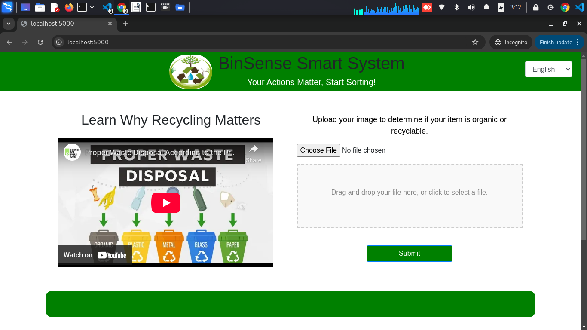
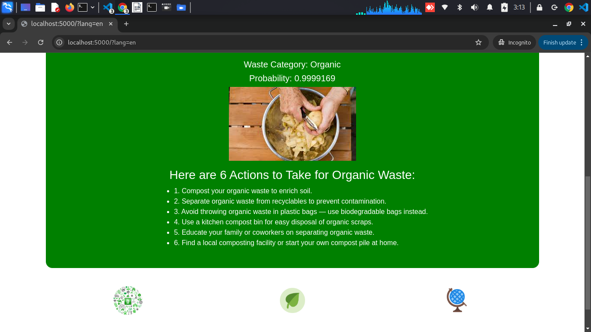

# Waste Segregation Using CNN


A Convolutional Neural Network (CNN)-based image classification system to automate the segregation of waste into **biodegradable** and **non-biodegradable** categories. This model can assist in sustainable waste management and reduce human intervention in the sorting process.

## 🧠 Project Overview

The goal of this project is to develop a deep learning model that can classify waste items from images into:
- **Biodegradable**: Items like food waste, paper, plant material, etc.
- **Non-Biodegradable**: Items like plastic, metal, glass, etc.

This system can be integrated into smart bins, recycling centers, or mobile apps to encourage responsible waste disposal.


## 🧰 Features

- Trained on labeled image datasets of biodegradable and non-biodegradable waste.
- Image preprocessing and data augmentation for better generalization.
- Model evaluation using accuracy, precision, recall, and confusion matrix.
- Easy to integrate into web or mobile applications.

## 🚀 How to Use

### 1. Clone the Repository

```bash
git clone https://github.com/yourusername/waste-segregation-cnn.git
cd waste-segregation-cnn
pip install -r requirements.txt


### 2. Train the Model

```bash
python src/train.py
python src/predict.py --image path_to_image.jpg


### 3. Evaluate Model
Model performance metrics will be saved and printed during/after training.

 Model Architecture
The CNN model is built using TensorFlow/Keras with the following structure:

Conv2D → ReLU → MaxPooling

Conv2D → ReLU → MaxPooling

Flatten → Dense → Dropout → Output (Sigmoid for binary classification)

