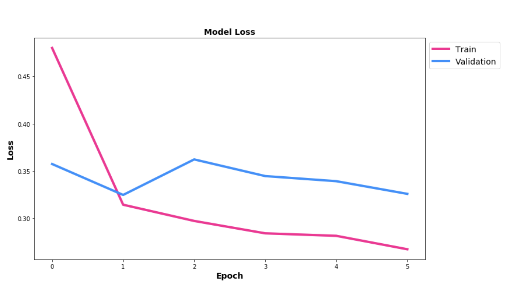
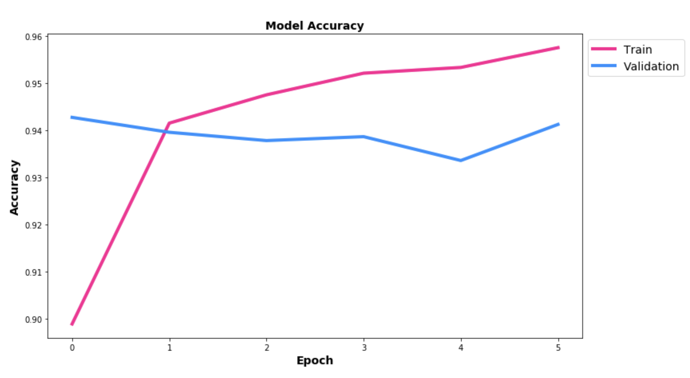

# Final Project: Machine Learning Waste Classification Model

**Project Members: Lareena Llamado, Kathy Manthey, Manuela Muñoz, Nicole Muscanell**

### Background & Purpose
Recycling waste material is a huge challenge globally. This is because waste is not only challenging to sort at the human level, but it is also time consuming and often hazardous. One promising area of research and innovation that could be used to address this problem is machine learning and artificial intelligence. Using smart technology to classify waste could be a cost efficient, safe, and possibly even more accurate method of sorting large amounts of waste in a timely manner, which could thereby help to improve the recycling rate. The purpose of this project is to build a machine learning model that classifies images of materials and objects as being organic or recyclable.

### The Data
The dataset we used is available on Kaggle and has over 22,5000 images and is divided into train data (85 %) and test data (15 %). The data are structured into two subfolders: "TEST" and "TRAIN", and within each, there are two more folders: "O" (for organic images) and "R" for recycled images.

**Link to data:** https://www.kaggle.com/techsash/waste-classification-data

### Model Building and Evaluation
We built a convolutional neural network model using Keras and Tensorflow. The base model was pre-trained transfer learning model: VGG16 with ImageNet weights. To this, we added customized dense layers in addition to other features such as layer freezing and dropout. We set our model to train for 20 epochs and added an early stopping callback. The highest accuracy reached was .94. The overall accuracy for the model was .939 and the loss was .365. Matplotlib and Seaborn were used to plot the results of the training and evaluation, in addition to generating visualizations of the base model features and layers.





### Front End Application
We built a front-end web application using Python Flask, which employs the following packages: flask, keras, numpy, tensorflow, and pillow. The web app allows users to upload a photo of their choice. We created two python scripts that renders the image from the uploading form and is then feeds it into our waste classification model. Specifically, we defined a function that calls the model prediction for each uploaded image, and we then linked these scripts to an html file to return a classification for the image: "Organic" or "Recyced", along with the probability score. 


![(Resources/static/images/image1.png)]
![(Resources/static/images/image1.png)]
![(Resources/static/images/image1.png)]
![(Resources/static/images/image1.png)]

### Conclusions
This is just a small step in applying machine learning to recylcing and waste sorting. In order to make a significant impact in waste sorting plants and on the recycling rate globally, much more sophisticated models, i.e., ones that can classify materials into multiple categories and sub-categories, would need to be developed so that waste could be efficiently and correctly sorted at a large scale level.

## How to run this app locally:
python main.py 

### File Structure:

```
project (main project folder)
│   index.py
│   main.py 
│
└───Resources
│   │    
│   └───Model
│     	  final_model_weights.hdf5
│  
└───templates
│   	  index.html
│          
└───static (uploaded images will be stored here) -- must be named "static"
       
```

## Steps:
* Download files into the above file structure
* Change file paths per above instructions
* Open and run the index.py file in terminal
* Once run, a web address will appear at the bottom of the terminal.  
* Open brower at "localhost:5000". 
* Select an image file using the "Choose File" button then click on "Submit".
* This should return a classification and probability score.
* Enjoy!
